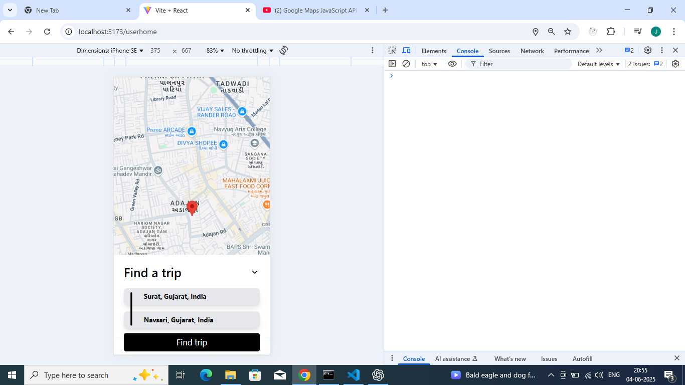
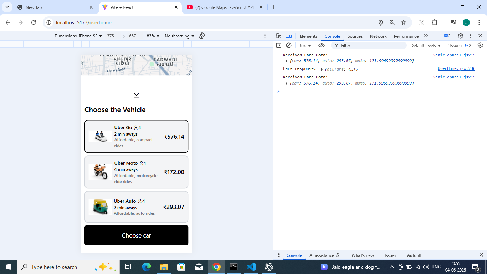
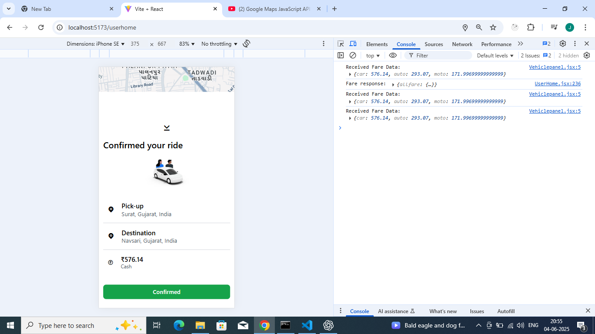

<<<<<<< HEAD

=======
# Uber Clone – Ride Sharing Platform

A full-stack ride-sharing application inspired by Uber, built for learning and portfolio purposes.  
This project demonstrates modern web development skills, including authentication, real-time communication, REST APIs, geolocation, and a clean UI/UX.

---

## 🚀 Features

- **User & Captain (Driver) Registration/Login**
- **Role-based Authentication** (JWT)
- **Book a Ride**: Users can search, select vehicles, and book rides.
- **Live Ride Tracking**: Real-time location updates using Google Maps.
- **Captain Dashboard**: Accept, start, and finish rides.
- **Real-time Notifications**: Socket.io for instant ride status updates.
- **Fare Calculation**: Dynamic fare based on distance and vehicle type.
- **OTP Verification**: Secure ride start with OTP.
- **Responsive UI**: Mobile-first, modern design.
- **Error Handling & Validation**: Both client and server side.

---

## 🛠️ Tech Stack

**Frontend:**
- React.js (with Hooks & Context API)
- React Router
- Axios
- Google Maps API
- GSAP (animations)
- Socket.io-client

**Backend:**
- Node.js
- Express.js
- MongoDB (Mongoose ODM)
- Socket.io (real-time)
- JWT Authentication
- Express-Validator
- Bcrypt (password hashing)

---

## 📁 Project Structure

```
/client
  /src
    /components      # Reusable React components
    /pages           # Main app pages (UserHome, CaptainHome, etc.)
    /context         # React Context for state management
    App.jsx
    main.jsx
/server
  /controller        # Express route controllers
  /models            # Mongoose models (User, Captain, Ride)
  /routes            # Express route definitions
  /services          # Business logic (fare, OTP, etc.)
  /db                # Database connection
  /middlerware       # Auth middleware
  socket.js          # Socket.io server logic
  server.js
  index.js
```

---

## ⚙️ Setup & Installation

### Prerequisites

- Node.js (v18+ recommended)
- MongoDB Atlas or local MongoDB
- Google Maps API Key

### 1. Clone the Repository

```bash
git clone https://github.com/yourusername/uber-clone.git
cd uber-clone
```

### 2. Setup Environment Variables

Create a `.env` file in `/server`:

```
MONGO_URI=your_mongodb_connection_string
JWT_SECRET_KEY=your_jwt_secret
PORT=8000
Google_api_key=your_google_maps_api_key
```

### 3. Install Dependencies

```bash
# In /server
cd server
npm install

# In /client
cd ../client
npm install
```

### 4. Run the Application

```bash
# Start backend
cd server
npm run dev

# Start frontend (in a new terminal)
cd ../client
npm run dev
```

- Frontend: [http://localhost:5173](http://localhost:5173)
- Backend: [http://localhost:8000](http://localhost:8000)

---

## 🧑‍💻 Usage

- **User:** Register, login, search for rides, book, and track rides live.
- **Captain:** Register, login, accept rides, start/finish rides, and update location in real-time.

---

## 📸 Screenshots




---

## 📝 Learning Highlights

- **Authentication:** JWT-based, role-specific access.
- **Real-time:** Socket.io for instant updates between users and captains.
- **Geolocation:** Google Maps integration for live tracking.
- **RESTful API:** Clean separation of concerns and modular code.
- **UI/UX:** Responsive, animated, and user-friendly interface.
- **Error Handling:** Graceful error messages and validation everywhere.

---

## 🏆 Why This Project?

This project is designed to demonstrate:
- Full-stack development skills
- Real-time web application architecture
- Clean code, modular structure, and best practices
- Ability to integrate third-party APIs and handle async flows

---

## 🙋‍♂️ About Me

I am a passionate student and aspiring developer, building real-world projects to learn and showcase my skills.  
_If you like this project or want to collaborate, feel free to connect!_

---

## 📄 License

This project is for educational purposes.

---

**_Star this repo if you found it helpful!_**
>>>>>>> 1494178 (Moved README.md from client folder to root)
